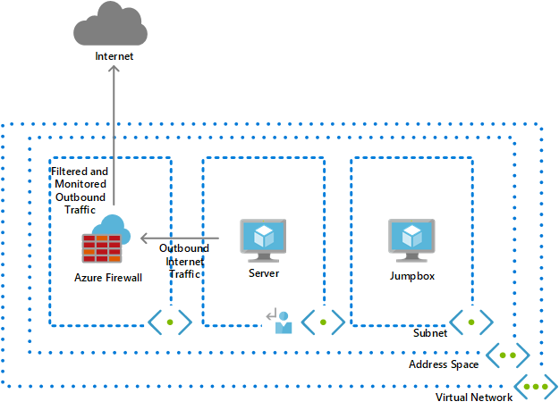
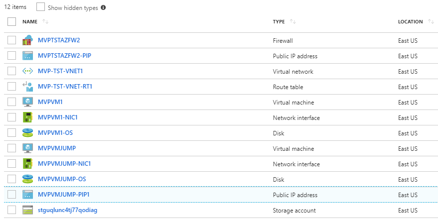

# Azure Firewall Lab 

This template will provision a lab environment for Azure Firewall. It will provision a virtual network, 3 subnets, two VM's and a Azure Firewall. 

Once successfully provisioned, it will have the following resources. 

For more information this please visit the following blog:
https://sameeraman.wordpress.com/2018/07/15/azure-firewall-quick-start-arm-template/
