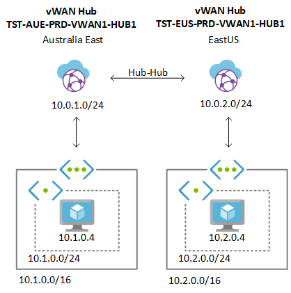
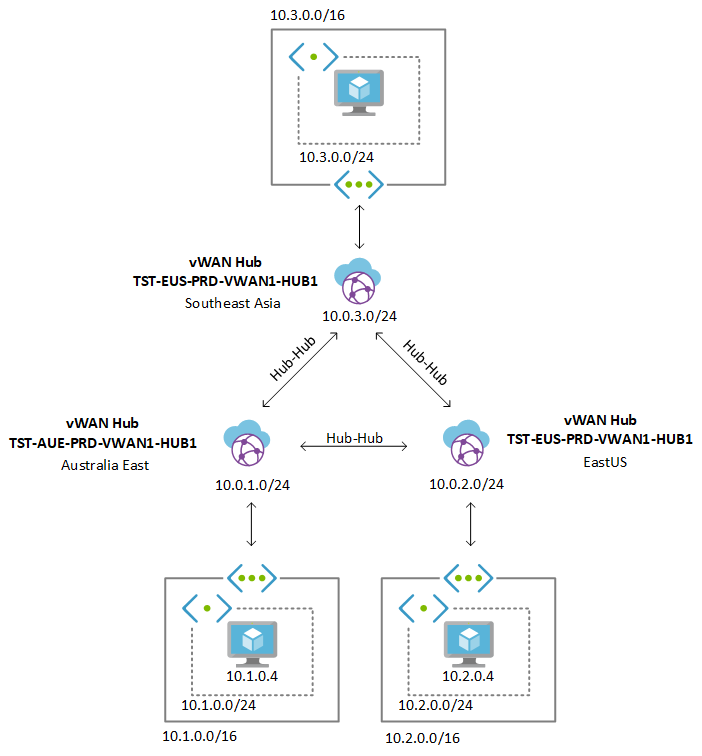

# Azure Virtual VWAN Lab Setup

This template will provision a lab environment that demonstrate features and capabilities of Azure Virtual WAN (VWAN). The template will provision VWAN resource and N number of regional hubs. Moreover, it will create a spoke VNet for each hub region and connect it to the VWAN Hub in the respective region. Each VNet will also encompass a VM created within a subnet.

The template is a deployed at the subscription level and it creates multiple resource group. The template uses nested deployment in a modularized manner. 

This page provides information around how this ARM Template can be used with examples. 

## Example 1 - Azure VWAN 2 Region setup

This example provisions a setup with 2 VWAN Hubs including a VNET and VM in each region. The final solution after deployment will look like below. 



The two region setup can be provisioned using the [vwansubdeploy.parameters.json](/vwansubdeploy.parameters.json) file. An example deployment will look like below. 

```powershell
New-AzSubscriptionDeployment -Name "TESTVWANDeploy" -Location "Australia East" -TemplateFile .\vwansubdeploy.json -TemplateParameterFile .\vwansubdeploy.parameters.json
```

## Example 2 - Azure VWAN 3 Region Setup

This example provisions a setup with 3 VWAN hubs similar to above. The final solution after deployment will like below. 



The three region setup can be provisioned using the [vwansubdeploy-3.parameters.json](/vwansubdeploy-3.parameters.json) file. An example deployment will look like below. 

```powershell
New-AzSubscriptionDeployment -Name "TESTVWANDeploy3" -Location "Australia East" -TemplateFile .\vwansubdeploy.json -TemplateParameterFile .\vwansubdeploy-3.parameters.json
```


