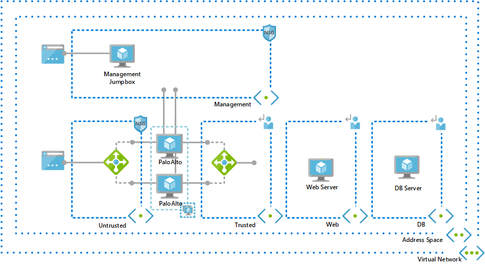
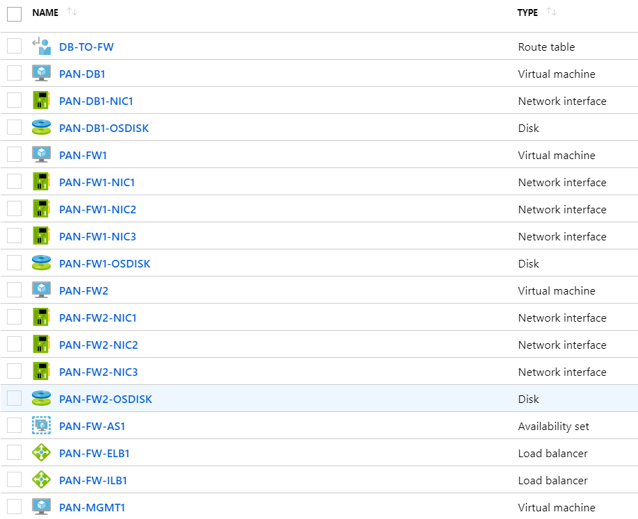
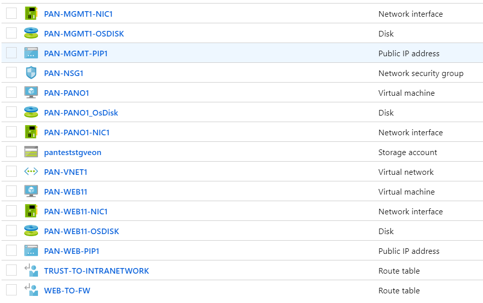

# Palo Alto HA Architecture Lab 

This template will provision a lab environment that demonstrate the use of Palo Alto HA pair in Azure. It will provision a virtual network, 5 subnets, two workload VM's, Management Jumpbox and a pair of Palo Altos. 

Once successfully provisioned, it will have the following resources. 

This Template is a based on the single NVA architecture provided by Palo Alto - https://github.com/PaloAltoNetworks/azure/tree/master/two-tier-sample

Once you provision the ARM template, you will have to load the Palo Alto Configuration with the given xml files into the NVAs. I have provided a word file with some screenshots to guide you with the steps for loading the XML files. 

